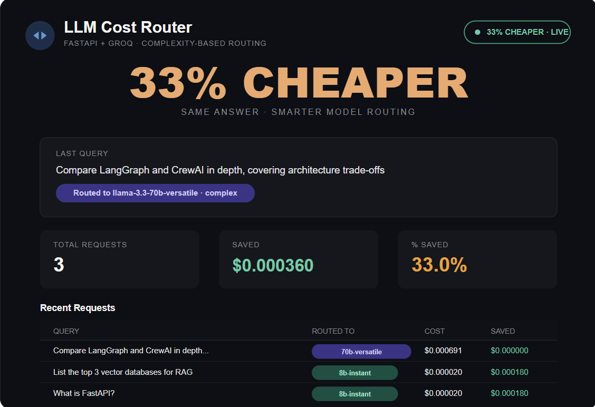

# ⚡ LLM Cost Router

A Streamlit app that routes each query to a cheap or expensive Groq model based on complexity, then shows a live dashboard of what you actually spent vs. what you'd have spent if every request went to the big model.

<p align="left">
  <a href="https://github.com/ayush-s-tomar/llm-cost-router/actions/workflows/ci.yml"></a>
  <a href="LICENSE"></a>
  <a href="https://www.python.org/"></a>
  <a href="https://streamlit.io/"></a>
  <a href="https://groq.com/"></a>
  <a href="https://llm-cost-router.streamlit.app/"></a>
  <a href="https://github.com/ayush-s-tomar/llm-cost-router/stargazers"></a>
  <a href="https://github.com/ayush-s-tomar/llm-cost-router/commits/main"></a>
</p>

**🔗 Live demo:** [llm-cost-router.streamlit.app](https://llm-cost-router.streamlit.app/)

---

## Live Demo


### Screenshots

<p>
  
  
</p>

### Video Walkthrough

https://github.com/user-attachments/assets/ed43ddfa-fc49-4b12-b89d-9452307dddb0

A simple query (`"What is FastAPI?"`) routes to **Llama 3.1 8B Instant** and costs `$0.000047`. A complex query (`"Compare LangGraph and CrewAI in depth..."`) correctly routes to **Llama 3.3 70B Versatile** instead — the router isn't just always picking the cheap model, it's making a real complexity-based call.

---

## Why this exists

Most agent projects call one model for everything, regardless of whether the query is "what is X" or "design a distributed system architecture." That's money left on the table.

This router classifies each query with a near-free heuristic (no LLM call needed just to decide which LLM to call), sends simple queries to **Llama 3.1 8B Instant** (`$0.05` / `$0.08` per 1M input/output tokens) and complex ones to **Llama 3.3 70B Versatile** (`$0.59` / `$0.79` per 1M tokens) — an **~11x price gap** — and tracks the savings.

## How routing works

The classifier in `app.py` checks for:

- Query length (very long queries default to the big model)
- Complexity keywords (`"compare"`, `"analyze"`, `"design"`, `"trade-off"`, `"step by step"`, etc.)
- Simple-query patterns (`"what is"`, `"who is"`, `"define"`, `"list"`)

No ML model, no extra API call — routing decisions have to be free or they defeat the purpose.

---

## Quickstart (terminal)

```powershell
# 1. Clone the repo
git clone https://github.com/ayush-s-tomar/llm-cost-router.git
cd llm-cost-router

# 2. Create and activate a virtual environment
python -m venv venv
venv\Scripts\activate

# 3. Install dependencies
pip install -r requirements.txt

# 4. Set up your Groq API key (Streamlit secrets, not .env)
New-Item -ItemType Directory -Force -Path .streamlit | Out-Null
[System.IO.File]::WriteAllText(
    "$PWD\.streamlit\secrets.toml",
    'GROQ_API_KEY = "your-key-here"' + "`n",
    (New-Object System.Text.UTF8Encoding $false)
)
# Get a free key at https://console.groq.com

# 5. Run the app
python -m streamlit run app.py
```

Open **http://localhost:8501** — type a query in the box:

- Try `What is FastAPI?` → routes to the cheap model
- Try `Compare LangGraph and CrewAI in depth, covering architecture trade-offs` → routes to the expensive model

Watch the **"Saved"** and **"% Saved"** numbers update as you send more queries.

---

## Deploying to Streamlit Community Cloud

Push to GitHub, connect the repo at [share.streamlit.io](https://share.streamlit.io), and add `GROQ_API_KEY` under **Settings → Secrets** in the same TOML format as `.streamlit/secrets.toml`. Never commit that file — it's already in `.gitignore`.

---

## Architecture

```
llm-cost-router/
├── app.py                       Streamlit app: UI, routing logic, Groq calls, live dashboard
├── requirements.txt             dependencies
├── .streamlit/secrets.toml      local-only Groq key (gitignored)
└── assets/                      screenshots, GIF, and video used in this README
```

---

## Notes

- Pricing constants are from groq.com/pricing as of July 2026 — update them if Groq changes rates.
- `httpx` is pinned below 0.28 — newer versions break the Groq SDK's client init (`unexpected keyword argument 'proxies'`).
- Token counts use the real `usage` field from Groq's API response when available, falling back to a rough character-count estimate.

---

## Contributing

Issues and PRs are welcome. Before opening a PR, please run:

```powershell
pip install -r requirements.txt
ruff check .
```

CI runs the same checks automatically on every push and PR — see [`.github/workflows/ci.yml`](.github/workflows/ci.yml).

## License

Released under the [MIT License](LICENSE).

## Author

**Ayush Singh Tomar** — [GitHub](https://github.com/ayush-s-tomar)